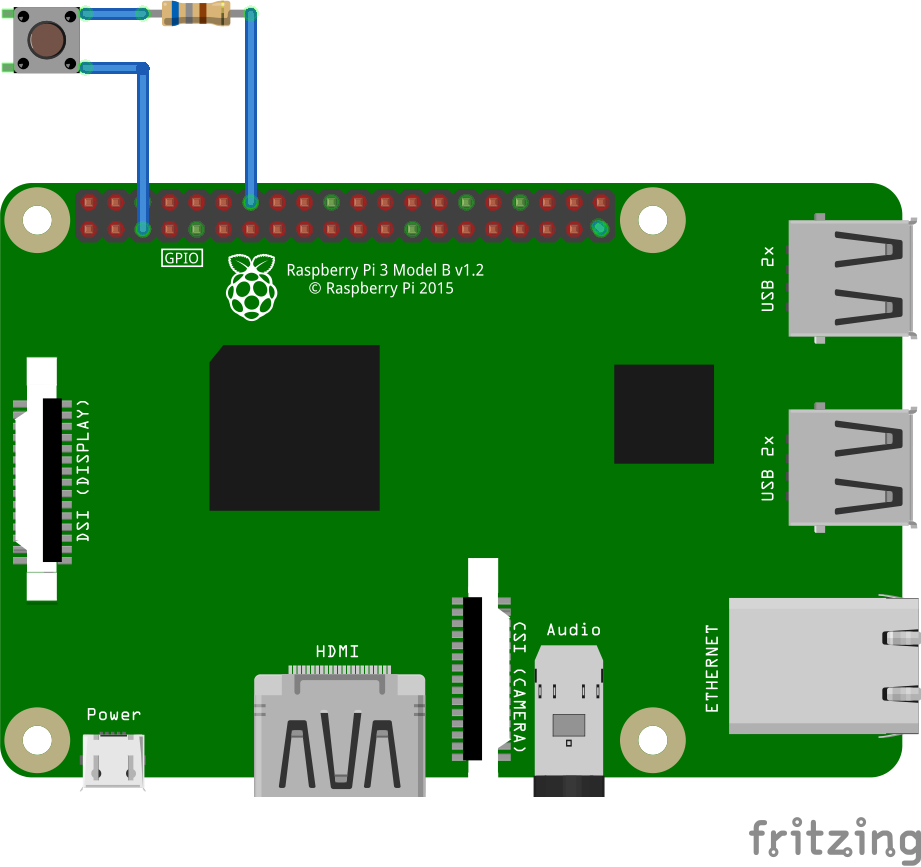

# RPi Button Shutdown and Boot
Raspberry Pi (RPi) button shutdown python3 script. The button shuts down RPi safely by executing `sudo shutdown -h now` command if the button is keep pressed more than 3 seconds. This button also works as RPi power on if the power outlet is connected and RPi is in shutdown state. You do not need to unplug/plug power outlet.
If you have adafruit_ssd1306 compatible I2C display, shutdown message can be seen through the LCD.

* Version 0.2
* March 1, 2021
* Taka Kitazume


## Prerequisites

* Raspberry Pi (2, 3B, 3B+, Zero) x 1
  * Raspberry Pi OS (Lite)
  * git
* Tacticle button x 1
* Breadboard x 1
* Jumper wires Male/Female x 2
* (Optional) SSD1306 I2C display

## Diagram
<kbd>

</kbd>


## Setup

1. Assemble your kit as you see in the diagram. You must use GPIO3 for one side of the tacticle button. You can use any ground pin.
2. Create **services** directory under `pi` user home directory, move to that directory.
  ```
  cd ~
  mkdir services
  cd services
  ```
3. Git clone this project
  ```
  git clone https://github.com/takarocks/rpishutdowndetector.git
  ```
4. Change to project directory `rpishutdowndetector`
  ```
  cd rpishutdowndetector
  ```
5. (Optional) If you have SSD1306 display connected, modify shutdowndetechtor.py, change following SSD1306 in line 18 to True.
  ```
  SSD1306 = True
  ```
6. Copy the shutdowndtector.service file into **/etc/systemd/system/** directory.
  ```
  sudo cp shutdowndetector.service /etc/systemd/system/
  ```
7. Start and enable the shutdowndetector.service.
  ```
  sudo systemctl daemon-reload
  sudo systemctl enable shutdowndetector.service
  ```
8. Reboot RPi.
9. Execute `systemctl` and confirm shutdowndetector.service is loaded, active and running.
  ```
  systemctl

  UNIT                        LOAD   ACTIVE SUB       DESCRIPTION              
  shutdowndetector.service    loaded active running   Button shutdown detector  
  ```
10. Press the tacticle button longer than 3 seconds. RPi should shutdown.
11. Keep the outlet connected, press the tacticle button again when RPi shutdown completely. The button powers on the system and RPi boots.


## References
[systemd](https://www.raspberrypi.org/documentation/linux/usage/systemd.md) [www.raspberrypi.org]
